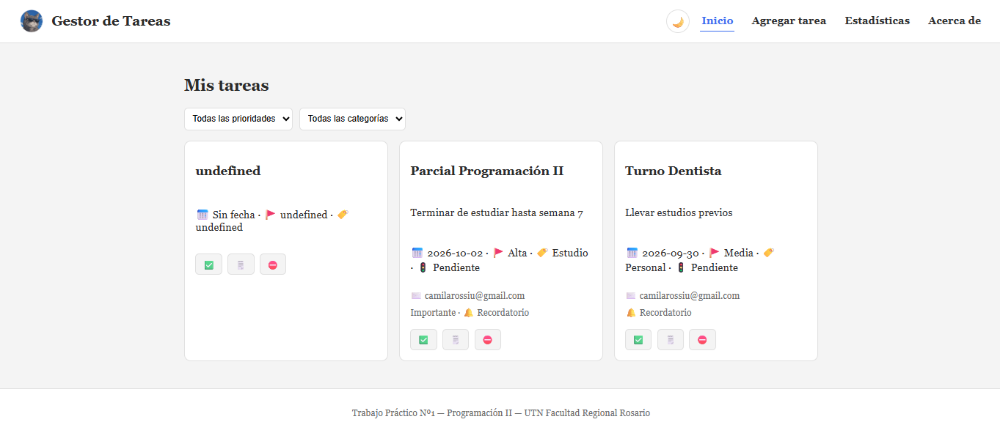
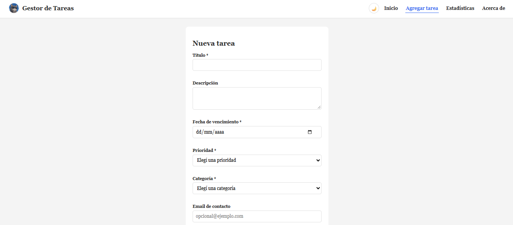
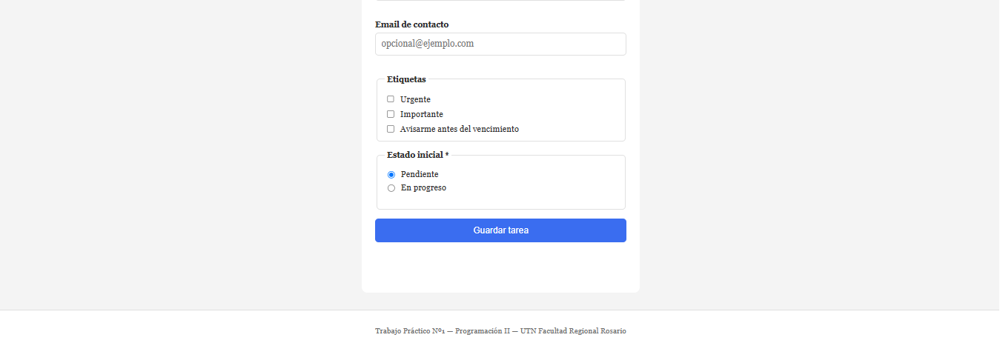
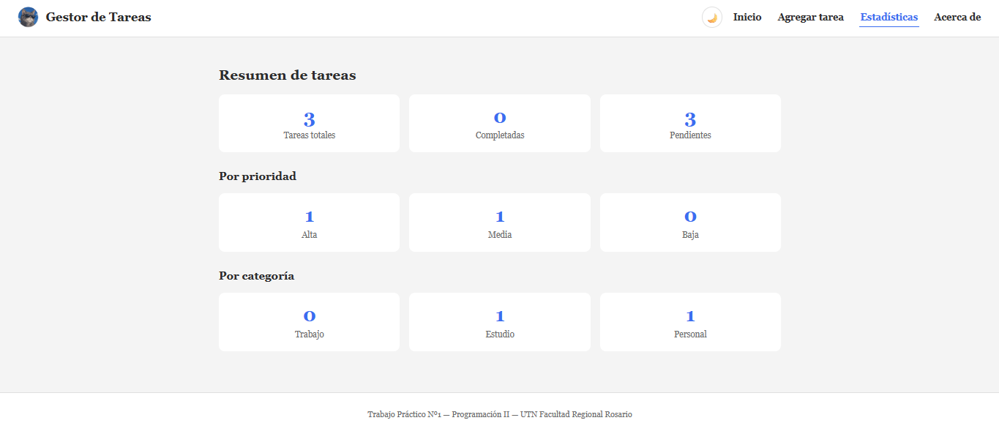
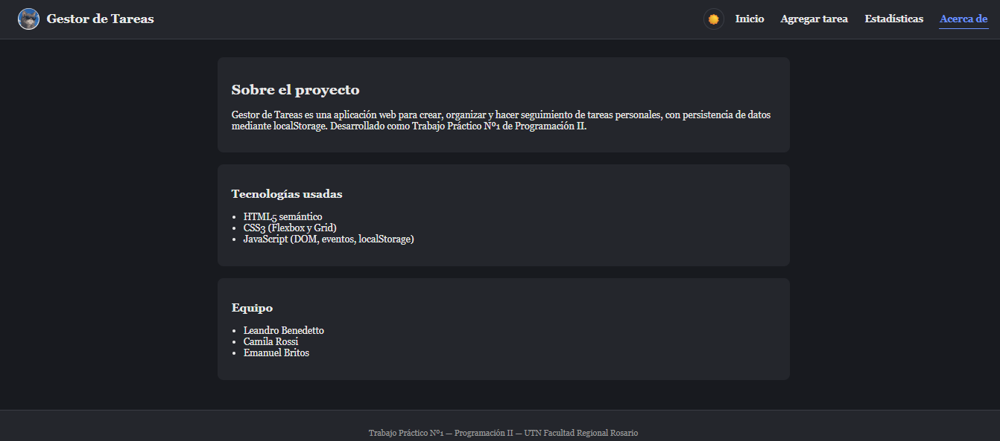

# Gestor de Tareas — TP1 Programación II

Aplicación web de gestión de tareas (To-Do List) desarrollada como Trabajo
Práctico Nº1 de la materia **Programación II** — Tecnicatura Universitaria en
Programación, UTN Facultad Regional Rosario.

## Descripción del proyecto

Permite crear, editar, completar y borrar tareas, cada una con título,
descripción, fecha límite, prioridad, categoría y recordatorio
opcional. Los datos persisten en el navegador mediante `localStorage`
(sin backend). Incluye una sección de estadísticas que resume la información
guardada, y un diseño responsive, con menú hamburguesa en tablet/celular.

## Tecnologías usadas

- HTML semántico (`header`, `nav`, `main`, `footer`)
- CSS — Flexbox y Grid, sin frameworks
- JS — manipulación del DOM, eventos, `localStorage`

## Cómo ejecutar el proyecto

No requiere instalación ni dependencias, ya que es HTML/CSS/JS puro sin backend.

1. Cloná o descargá este repositorio.
2. Abrí el archivo `index.html` en tu navegador (doble clic, o clic derecho →
   "Abrir con" tu navegador preferido).
3. Opcional: podés usar la extensión "Live Server" de VS Code teniendo el código 
   allí

No hace falta ninguna configuración adicional: los datos se guardan
automáticamente en el `localStorage` del navegador que se use.

## Capturas de pantalla

### Página principal


### Agregar tarea



### Estadísticas


### Modo oscuro


## Funcionalidades implementadas

- CRUD completo de tareas (crear, leer, editar, eliminar, marcar como
  completada) persistido en `localStorage`
- Formulario de 8 campos (título, descripción, fecha de vencimiento,
  prioridad, categoría, email de contacto, etiquetas y estado inicial)
  con validación en tiempo real
- Validación cruzada: la fecha de vencimiento no puede ser anterior a hoy
- Filtros por prioridad y por categoría en la lista de tareas
- Página de estadísticas con contadores por estado, prioridad y categoría
- Diseño responsive con 3 breakpoints (Desktop, Tablet con menú hamburguesa,
  Celular en stack vertical)
- Animaciones: entrada de tarjetas (`@keyframes`), transiciones en
  hover/focus, animación del ícono hamburguesa

## Extras implementados

- **Dark/Light mode persistente**: toggle de tema que guarda la preferencia
  del usuario en `localStorage` y la aplica automáticamente al recargar
  cualquier página, evitando el parpadeo de tema incorrecto.

## Estructura del proyecto

```
/TPI_Programacion_II
│  README.md
│  index.html          → lista de tareas
│  agregar.html        → formulario (crear / editar)
│  estadisticas.html   → resumen de datos guardados
│  acerca.html         → información del proyecto y equipo
│  styles.css
│  app.js
├── /assets
│   └── /icons          → favicon.ico, logo.png
|   └── /img            → capturas de pantalla
```

## Equipo

- Leandro Benedetto
- Camila Rossi
- Emanuel Britos
